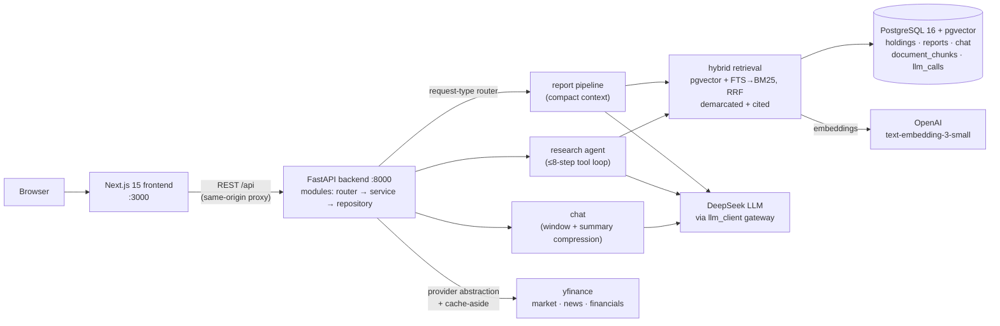

# AI Stock Analyst

[](https://github.com/xy9iao/ai-stock-analyst/actions/workflows/ci.yml)
[](LICENSE)


A **local-first, AI-powered stock research assistant** — track your holdings and watchlist, pull live market data and news, generate AI research reports, and chat with an investment assistant that knows your portfolio. Full-stack: FastAPI + PostgreSQL backend, Next.js frontend, one-command Docker dev environment.

> **Disclaimer:** This project is for **research and educational use only** — it is not a trading bot, brokerage app, or financial advice. Market data may be delayed or inaccurate; verify independently before making decisions.

## Live Demo

🔗 **Demo: [ai-stock-analyst-pi.vercel.app](https://ai-stock-analyst-pi.vercel.app)** — deployed on Vercel + Render + Neon via [the deployment guide](docs/guides/deployment.md)

The demo is a shared, unauthenticated instance hardened for public exposure: every visitor gets an isolated **anonymous session** (cookie-scoped data, 7-day TTL — no account needed), and LLM cost is protected by **three independent layers**: a prepaid budget hard cap, an admin-controlled master switch with a TTL, and per-session limits (3 reports / 20 chat replies, counted in LLM calls). First load may take up to a minute if the free-tier backend was asleep. Use **"New demo session"** in the footer to start fresh.

## Screenshots

| Holdings | Stock detail |
| --- | --- |
|  |  |

| AI report | Chat |
| --- | --- |
|  |  |

## Features

- **Holdings & watchlist** — CRUD with validation; live prices, day change, market value, and gain/loss per position.
- **Market data** — quotes and price/volume charts (1d / 1w / 1m / 1y) via a swappable provider abstraction (yfinance today), cached in Postgres.
- **News & financials** — company headlines and compact financial snapshots, used as context for AI analysis.
- **AI reports** — single-stock and portfolio research reports: the backend assembles a compact context from your data, calls the LLM (DeepSeek, OpenAI-compatible), and stores the result as Markdown — exportable with one click. Reports carry **clickable source citations** grounded in hybrid retrieval (pgvector + Postgres FTS→BM25, RRF-fused).
- **Research agent** — a hand-written tool-use loop (5 read-only tools + document search, ≤8 steps) that answers open-ended questions by gathering evidence and files an archived memo; routed separately from the fixed report pipeline.
- **Chat** — a multi-turn investment assistant with **toggleable context injection** (holdings / watchlist / a focus ticker / recent reports); long conversations stay affordable via **sliding-window + running-summary compression**.
- **Trustworthy by design** — every LLM claim in a report is cited or marked unverified; retrieved public content is demarcated + sanitized against indirect prompt injection (OWASP LLM01); a local regression gate (coverage + citation + poisoned-chunk cases) blocks quality drift on any prompt/model change.
- **Beginner-friendly UI** — finance-term tooltips, loading/empty/error states, responsive layout, and a persistent not-financial-advice notice.
- **Demo-hardened deployment** — anonymous session isolation (state isolation without an auth system), a three-layer LLM cost defense, and per-call token/latency observability (`llm_calls` table + `/api/stats`).

## Architecture

A **modular monolith**: the backend owns everything external (database, market/news APIs, the LLM, all secrets); the frontend is presentation-only and talks to nothing but the backend REST API.



Key design decisions:

- **Layered modules** — each business area is `backend/app/modules/<name>/` with `router → service → repository` + Pydantic schemas; modules call each other in Python, never over HTTP.
- **Provider abstraction** — market/news/financial sources are `typing.Protocol` interfaces with config-selected implementations, so yfinance can be swapped for a paid API without touching business logic.
- **One LLM gateway** — every LLM call routes through `modules/ai/llm_client.py`: one place for prompt safety boundaries, model switching, and cost control.
- **Compact context injection** — the LLM receives small, curated context blocks built from Postgres (never raw API payloads or full articles).
- **Request-type routing (v1)** — closed data needs (reports) take a fixed pipeline; open-ended questions take a hand-written agent loop; chat stays single-call. One `llm_client` gateway underlies all three ([Decision 011](docs/planning/decisions.md)).
- **Hybrid RAG with citations (v1)** — pgvector cosine + Postgres FTS rescored with BM25, RRF-fused; retrieved chunks are demarcated against injection and their claims carry clickable citations ([Decisions 012–013](docs/planning/decisions.md)).
- **Measured (v1):** 79% of agent-path prompt tokens served from the provider's prefix cache; ~20% net input-token saving from long-chat compression (44–70% per compression event); a local regression gate (coverage + citation + poisoned-chunk cases) guards every prompt/model change.

More depth in the guides: [Backend](docs/guides/backend.md) · [API](docs/guides/api.md) · [Database](docs/guides/database.md) · [Frontend & design system](docs/guides/frontend.md) · [Development workflow](docs/guides/development-workflow.md) · [Deployment](docs/guides/deployment.md)

## Tech Stack

| Layer | Technologies |
| --- | --- |
| Backend | Python 3.12, FastAPI, Pydantic v2, SQLAlchemy 2 (sync), Alembic, psycopg 3, managed by `uv` |
| Frontend | Next.js 15 (App Router), React 19, TypeScript (strict), Tailwind CSS, shadcn-style components, `pnpm` |
| AI | DeepSeek via the OpenAI-compatible SDK — centralized in one backend module |
| Data | PostgreSQL 16, yfinance behind a provider abstraction, Postgres-backed cache |
| Testing | pytest + pytest-cov (163 backend tests + local `eval/` regression gate), Vitest + React Testing Library (28 frontend tests) |
| Tooling / CI | Ruff, ESLint 9, GitHub Actions, Docker Compose |

## Getting Started

### Prerequisites

- [Docker Desktop](https://www.docker.com/products/docker-desktop/) (the only hard requirement for the quick start)
- A [DeepSeek API key](https://platform.deepseek.com/) — optional; only needed for AI reports and chat

### Quick start (one command)

```bash
git clone https://github.com/xy9iao/ai-stock-analyst.git
cd ai-stock-analyst
cp .env.example .env        # add LLM_API_KEY=... for AI features (optional)
docker compose up --build
```

This builds the images, **runs database migrations automatically**, and starts:

- Frontend: http://localhost:3000
- Backend: http://localhost:8000 (health check: http://localhost:8000/api/health)
- PostgreSQL: localhost:5432

Without an LLM key the app still runs — holdings, watchlist, market data, and charts all work; reports and chat return an error until a key is set. Never commit your real `.env`.

### Local development (hot reload)

Docker images are frozen snapshots — for day-to-day coding, run the data layer in Docker and the frontend natively:

```bash
docker compose up postgres backend    # database + API
cd frontend && pnpm install && pnpm dev   # :3000 with hot reload, /api proxied to :8000
```

Or run the backend natively too (requires [uv](https://docs.astral.sh/uv/) and Node 20+ with corepack/pnpm):

```bash
cd backend && uv sync && uv run alembic upgrade head && uv run uvicorn app.main:app --reload
```

## Development

```bash
# Backend (from backend/)
uv run pytest                  # tests + coverage report
uv run ruff check .            # lint
uv run alembic revision --autogenerate -m "..."   # new migration after model changes

# Frontend (from frontend/)
pnpm test                      # Vitest suite
pnpm typecheck && pnpm lint && pnpm build
```

CI (GitHub Actions) enforces exactly these gates on every push/PR: backend **ruff + pytest**; frontend **typecheck + lint + test + build**.

## Project Structure

```
├── backend/
│   ├── app/
│   │   ├── core/          # config, database session, errors, logging
│   │   ├── models/        # all SQLAlchemy models (one file per table)
│   │   └── modules/       # feature modules: holdings, watchlist, market_data,
│   │                      # news, financials, ai, chat, health
│   │                      # each = router → service → repository + schemas
│   ├── alembic/           # database migrations
│   └── tests/             # pytest suite (SQLite in-memory, providers/LLM mocked)
├── frontend/
│   ├── app/               # Next.js App Router pages
│   ├── components/        # design system (ui/), layout, charts, reports
│   └── lib/               # typed API client (lib/api/), formatting, export
├── docs/                  # roadmap, guides, frozen planning docs
└── docker-compose.yml     # one-command dev stack
```

## Status & Roadmap

**v0 complete** (12 phases) and **v1 complete** (2026-07-21) — the Agent Layer: a hand-written tool-use research agent, hybrid RAG with cited reports, long-chat compression, and indirect-injection defense, all behind the single `llm_client` gateway with per-route cost observability. History in the [CHANGELOG](CHANGELOG.md); phase summaries and decisions in the [roadmap](docs/roadmap.md) and [decisions](docs/planning/decisions.md).

**v1 measured:** 79% of agent-path prompt tokens served from the provider's prefix cache (frozen static prefix + append-only history); ~20% net input-token saving from long-chat compression (44–70% per compression event); regression gate at coverage 0.983 with citation + poisoned-chunk cases.

The project is now in **demand-gated maintenance** — new work happens when the same need shows up 3+ times in real use.

**Add-ons & backlog (post-v1, unscheduled):**

- Local MCP wrapper for the agent's tools ([#35](https://github.com/xy9iao/ai-stock-analyst/issues/35)), news + financials on the Home page ([#14](https://github.com/xy9iao/ai-stock-analyst/issues/14)), ticker autocomplete ([#15](https://github.com/xy9iao/ai-stock-analyst/issues/15)), Playwright E2E ([#16](https://github.com/xy9iao/ai-stock-analyst/issues/16)), live agent-run status in the UI ([#32](https://github.com/xy9iao/ai-stock-analyst/issues/32))

## Contributing

This is a solo portfolio project, so it isn't seeking contributions — but issues and suggestions are welcome. If you spot a bug, [open an issue](https://github.com/xy9iao/ai-stock-analyst/issues).

## License

MIT — see [LICENSE](LICENSE). © Xinyang Qiao
